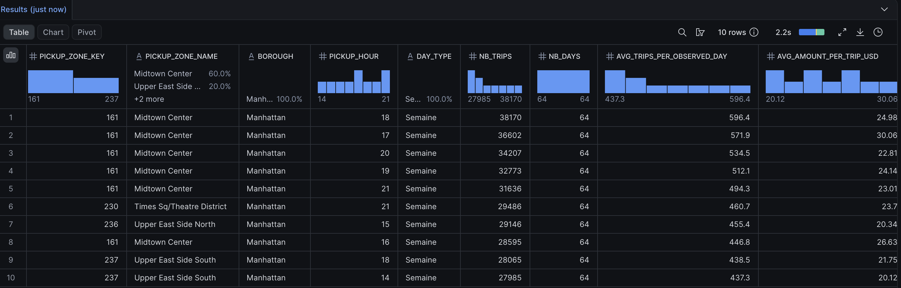
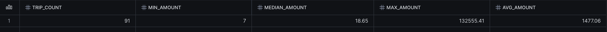

# Réponse à la direction d’Hudson Cab Partners

## Question et périmètre

Où et quand la demande de taxis jaunes est-elle la plus forte à New York, et
combien représente le montant enregistré par trajet selon la zone, l’heure et
le mode de paiement ?

Analyse de janvier à mars 2025, fondée sur les 10 382 378 trajets conservés dans
FCT_TRIPS après application des règles fournies. Le classement mesure les trajets
réalisés et enregistrés, par zone de départ, heure et type de jour.

## Trois conclusions

1. Midtown Center entre 18 h et 18 h 59 en semaine arrive en tête avec 38 170 trajets, soit 596,4 par jour observé, et cette zone occupe six places du top 10.
2. Sur ce créneau, les 32 496 trajets par carte représentent environ 85,1 % du volume et affichent un montant moyen de 25,54 $, contre 20,65 $ pour les 2 969 trajets en espèces.
3. La moyenne globale de 30,06 $ à Midtown Center à 17 h est influencée par 91 trajets « No charge » affichant une moyenne de 1 477,06 $, ce qui interdit de présenter ce créneau comme plus rentable sans examen des montants sources.

## Requête du top 10

Le classement est établi par volume cumulé décroissant, avec un ordre stable en
cas d’égalité. Les paramètres temporels sont explicites et la moyenne journalière
utilise les dates où au moins un trajet est présent dans le groupe.

```sql
-- Analyse des trajets valides de janvier à mars 2025.
-- Les montants enregistrés ne sont ni des bénéfices ni des encaissements vérifiés.
USE ROLE TRANSFORMER;
USE WAREHOUSE NYC_TAXI_WH;

-- 1. Top 10 zone de départ x heure x type de jour, classé par volume cumulé.
WITH trips AS (
    SELECT *
    FROM NYC_TAXI.MARTS.FCT_TRIPS
    WHERE source_file_month >= '2025-01-01'::date
      AND source_file_month < '2025-04-01'::date
), slots AS (
    SELECT
        pickup_zone_key,
        pickup_hour,
        is_weekend,
        COUNT(*) AS nb_trips,
        COUNT(DISTINCT pickup_date) AS nb_days,
        ROUND(COUNT(*) / NULLIF(COUNT(DISTINCT pickup_date), 0), 1) AS avg_trips_per_observed_day,
        ROUND(AVG(total_amount), 2) AS avg_amount_per_trip_usd
    FROM trips
    GROUP BY pickup_zone_key, pickup_hour, is_weekend
), top_slots AS (
    SELECT *
    FROM slots
    ORDER BY nb_trips DESC, pickup_zone_key, pickup_hour, is_weekend
    LIMIT 10
)
SELECT
    s.pickup_zone_key,
    COALESCE(z.zone_name, 'Zone sans correspondance') AS pickup_zone_name,
    z.borough,
    s.pickup_hour,
    IFF(s.is_weekend, 'Week-end', 'Semaine') AS day_type,
    s.nb_trips,
    s.nb_days,
    s.avg_trips_per_observed_day,
    s.avg_amount_per_trip_usd
FROM top_slots s
LEFT JOIN NYC_TAXI.MARTS.DIM_ZONE z ON z.zone_key = s.pickup_zone_key
ORDER BY s.nb_trips DESC, s.pickup_zone_key, s.pickup_hour, s.is_weekend;
```

Le [fichier SQL complet](../snowflake/business_analysis.sql) contient aussi la
ventilation par paiement des mêmes dix créneaux. Elle utilise les lignes de faits
pour calculer les moyennes, sans faire de moyenne simple des moyennes par jour.

## Les dix premiers résultats

Tous ces groupes sont à Manhattan, en semaine (lundi à vendredi), sur 64 dates
observées. L’heure 18 désigne le créneau de 18 h à 18 h 59.

| Zone de départ | Heure | Trajets | Trajets par jour observé | Montant moyen par trajet (USD) |
|---|---:|---:|---:|---:|
| Midtown Center | 18 | 38 170 | 596,4 | 24,98 |
| Midtown Center | 17 | 36 602 | 571,9 | 30,06 |
| Midtown Center | 20 | 34 207 | 534,5 | 22,81 |
| Midtown Center | 19 | 32 773 | 512,1 | 24,14 |
| Midtown Center | 21 | 31 636 | 494,3 | 23,01 |
| Times Sq/Theatre District | 21 | 29 486 | 460,7 | 23,70 |
| Upper East Side North | 15 | 29 146 | 455,4 | 20,34 |
| Midtown Center | 16 | 28 595 | 446,8 | 26,63 |
| Upper East Side South | 18 | 28 065 | 438,5 | 21,75 |
| Upper East Side South | 14 | 27 985 | 437,3 | 20,12 |



## Paiements et anomalie de montant

Extrait du [résultat CSV complet](resultats/top10_paiements_2025_t1.csv),
exporté de Snowflake le 9 octobre 2026 :

| Midtown Center, semaine | Paiement | Trajets | Montant moyen (USD) |
|---|---|---:|---:|
| 18 h | Credit card | 32 496 | 25,54 |
| 18 h | Cash | 2 969 | 20,65 |
| 18 h | Flex Fare trip | 2 222 | 23,17 |
| 18 h | Dispute | 364 | 23,68 |
| 18 h | No charge | 119 | 19,35 |
| 17 h | Credit card | 31 563 | 27,06 |
| 17 h | Cash | 3 077 | 21,64 |
| 17 h | Flex Fare trip | 1 489 | 24,68 |
| 17 h | Dispute | 382 | 21,90 |
| 17 h | No charge | 91 | 1 477,06 |

Les 50 lignes du CSV couvrent dix créneaux et cinq catégories de paiement par
créneau. La somme des volumes par paiement correspond exactement au top 10 pour
chacun des dix groupes. Les moyennes du CSV sont déjà arrondies : leur moyenne
pondérée ne reconstitue pas nécessairement au centime la moyenne calculée sur
les lignes sources.

À 17 h, la moyenne pondérée des quatre autres catégories est d’environ 26,45 $
(calcul à partir des moyennes arrondies). Cette comparaison mesure l’influence
des trajets No charge ; elle ne définit pas une nouvelle règle d’exclusion.
### Diagnostic des montants No charge à 17 h

La [requête de diagnostic](../snowflake/inspect_unusual_amounts.sql) a été exécutée
sur les 91 trajets du groupe. Le minimum vaut 7,00 $, la médiane 18,65 $, le maximum
132 555,41 $ et la moyenne 1 477,06 $.



L’[export des vingt montants les plus élevés](resultats/diagnostic_no_charge_top20.csv)
identifie le trajet suivant dans FCT_TRIPS :

| Champ | Valeur |
|---|---|
| Clé du trajet | 2ef0a12d92629dfc97d93396d25d704d |
| Départ | 2025-02-21 17:28:43 |
| Arrivée | 2025-02-21 17:53:04 |
| Durée calculée | 24 min 21 s |
| Distance | 2,2 miles |
| Fournisseur | 1 |
| fare_amount | 132 531,36 $ |
| surcharges_amount | 24,05 $ |
| Pourboires et péages | 0,00 $ |
| total_amount | 132 555,41 $ |
| Fichier d’origine indiqué | yellow_tripdata_2025-02.parquet |

Le deuxième montant du groupe est de 118,91 $. Le maximum est donc isolé parmi
ces 91 trajets et explique l’essentiel de l’écart entre moyenne et médiane.
En retirant uniquement ce trajet à titre de diagnostic, la moyenne des 90 autres
serait d’environ 20,63 $ (estimation à partir de la moyenne arrondie).

La somme du tarif et des surtaxes retrouve exactement le total affiché. L’anomalie
ne provient donc pas d’une simple addition incorrecte de ces composantes dans le
résultat : elle est déjà visible dans fare_amount de la table de faits. Les données
exportées ne permettent pas d’établir la cause de ce montant ni d’affirmer qu’une
comparaison directe avec le Parquet source a été effectuée.

Ce trajet respecte les bornes de durée et distance, et les contrôles des montants
fournis ne testent que certaines valeurs non positives. Il peut donc être classé
valide tout en restant suspect pour l’analyse financière. Les résultats, les
règles SQL fournies et les lignes sources sont conservés sans correction arbitraire.

## Limites

- La source couvre les taxis jaunes de la TLC, pas uniquement les 180 taxis de Hudson Cab Partners ; elle ne mesure pas les demandes non satisfaites ni la disponibilité concurrente.
- Le classement porte sur des volumes cumulés : les jours de semaine sont plus nombreux que ceux du week-end ; les moyennes journalières excluent les jours sans trajet dans le groupe.
- total_amount est un montant enregistré, pas un bénéfice net ni un encaissement vérifié ; les frais d’exploitation ne sont pas disponibles et les catégories Dispute et No charge appellent une interprétation prudente.
- Les écarts entre moyens de paiement ne démontrent pas un effet causal du paiement : les trajets peuvent différer par leur distance, leur durée ou leur destination.
- Les règles fournies écartent certains trajets mais ne contrôlent ni une borne supérieure de montant ni la cohérence complète entre montant et mode de paiement.
- Les zones spéciales et les correspondances absentes ne sont pas exclues du classement par la requête ; aucune n’apparaît dans les dix groupes affichés.
- Les résultats portent uniquement sur le premier trimestre 2025 et ne garantissent pas une demande identique à une autre période.
