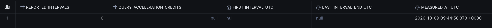
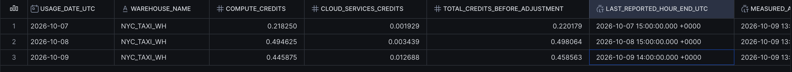

# Consommation Snowflake — relevé du 9 octobre 2026

## Périmètre et mesure

La requête [verify_credits.sql](../snowflake/verify_credits.sql) a été exécutée
manuellement avec ACCOUNTADMIN sur NYC_TAXI_WH. Le relevé est horodaté du
9 octobre 2026 à 09:42:02.951 UTC et porte sur l'historique publié depuis le
6 octobre 2026. Il inclut l'activité du warehouse pour les chargements,
transformations, essais et analyses manuelles, sans attribution à une seule exécution.

Source : [export de consommation](resultats/credits_warehouse_2026-10-09.csv).

| Jour UTC | Calcul | Services cloud | Total brut |
|---|---:|---:|---:|
| 7 octobre | 0,218250 | 0,001929 | 0,220179 |
| 8 octobre | 0,494625 | 0,003439 | 0,498064 |
| 9 octobre | 0,376125 | 0,011964 | 0,388089 |
| **Total publié** | **1,089000** | **0,017332** | **1,106332** |

Les sommes sont exprimées en crédits, sans conversion monétaire. L'absence de
ligne pour le 6 octobre signifie qu'aucune ligne n'est retournée pour cette date.
Le total est brut, avant les ajustements des services cloud ; ce n'est pas une
facture ni une mesure du stockage ou de tous les services du compte.

L'historique peut présenter un délai jusqu'à trois heures, et six heures pour
les services cloud. END_TIME est la borne d'un intervalle horaire : la valeur
10:00 UTC affichée le 9 octobre ne signifie pas que toute cette heure est complète
au moment de l'extraction à 09:42 UTC.

## Configuration observée

Source : [export SHOW WAREHOUSES](resultats/configuration_warehouse_2026-10-09.csv).

| Paramètre | Valeur |
|---|---|
| Warehouse | NYC_TAXI_WH |
| Type | STANDARD |
| Taille | X-Small |
| Nombre minimal / maximal de clusters | 1 / 1 |
| Suspension automatique | 60 secondes |
| Reprise automatique | true |
| Propriétaire | SYSADMIN |
| État lors de l'export | STARTED |
| Accélération des requêtes activée | true |
| Facteur maximal d'accélération | 8 |

La taille et la suspension correspondent au brief. L'état STARTED est un état
instantané ; l'export ne démontre pas à lui seul le passage ultérieur en suspension.
L'accélération des requêtes est activée dans la configuration constatée ; ce
constat ne prouve pas qu'elle a effectivement consommé des crédits. Son historique
séparé est interrogé par [verify_acceleration_credits.sql](../snowflake/verify_acceleration_credits.sql).
Le relevé de 1,106332 crédit n'inclut pas une éventuelle consommation de ce service.

Références : [historique du warehouse](https://docs.snowflake.com/en/sql-reference/account-usage/warehouse_metering_history),
[historique de l'accélération](https://docs.snowflake.com/en/sql-reference/account-usage/query_acceleration_history).

## Contrôle complémentaire de l'accélération

Le 9 octobre 2026 à 09:44:58.373 UTC, la requête sur
QUERY_ACCELERATION_HISTORY retourne zéro intervalle, avec une somme et des bornes
à NULL, pour NYC_TAXI_WH et les intervalles débutant entre le 6 octobre 2026 à
00:00 UTC inclus et le 9 octobre 2026 à 09:42:02.951 UTC exclu.

SUM renvoie NULL lorsqu'aucune ligne n'est présente. Ce résultat signifie qu'aucune
consommation d'accélération n'est publiée pour ce périmètre au moment du contrôle,
malgré l'activation du service. Le délai de publication pouvant atteindre trois
heures, il ne prouve pas une absence définitive de consommation récente.
Le relevé initial correspond à 1,106332 crédit brut de warehouse,
avec aucune consommation additionnelle d'accélération publiée lors du contrôle.

## Relevé complémentaire du 9 octobre

La nouvelle capture de consommation présente les valeurs suivantes. Elle conserve
le même warehouse et la même date de début de période ; l'activité supplémentaire
et la publication différée des métriques peuvent faire évoluer les crédits.

| Jour UTC | Calcul | Services cloud | Total brut |
|---|---:|---:|---:|
| 7 octobre | 0,218250 | 0,001929 | 0,220179 |
| 8 octobre | 0,494625 | 0,003439 | 0,498064 |
| 9 octobre | 0,445875 | 0,012688 | 0,458563 |
| **Total publié** | **1,158750** | **0,018056** | **1,176806** |

Le total le plus récent documenté est donc **1,176806 crédit brut de warehouse**.
Les valeurs de cette table sont transcrites depuis la capture, et non depuis
l'export CSV du relevé initial. La colonne de l'heure exacte de mesure est tronquée
sur l'image ; elle n'est pas reconstituée. La dernière borne horaire publiée visible
est le 9 octobre à 14:00 UTC ; ce n'est pas nécessairement une heure complète au
moment de la mesure. Les limites de périmètre et de délai décrites ci-dessus restent
applicables. Le contrôle de l'accélération correspond uniquement au relevé initial.
