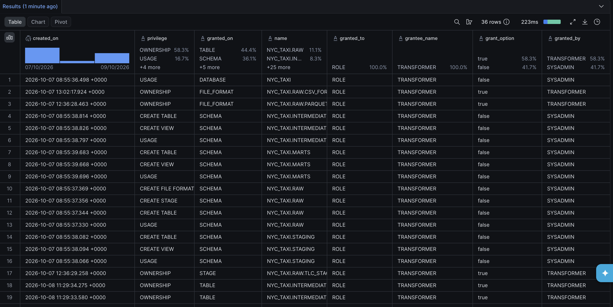
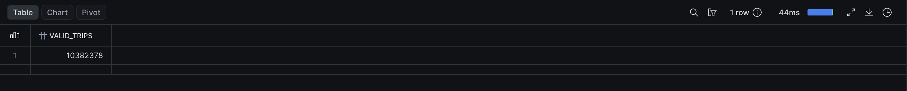

# Vérification des droits — 9 octobre 2026

Le [script de contrôle](../snowflake/verify_permissions.sql) utilise TRANSFORMER,
désactive les rôles secondaires, vérifie une lecture dans le projet, liste les
droits, puis tente une lecture de l'historique de consommation hors du périmètre.

## Droits observés

L'[export SHOW GRANTS](resultats/droits_transformer_2026-10-09_1528.csv) comporte 36 droits
attribués à TRANSFORMER. Tous les objets de cet export appartiennent à NYC_TAXI
ou au warehouse NYC_TAXI_WH.

| Périmètre | Droits observés |
|---|---|
| Base NYC_TAXI | USAGE |
| Warehouse NYC_TAXI_WH | USAGE |
| Schéma RAW | USAGE, CREATE TABLE, CREATE STAGE, CREATE FILE FORMAT |
| Schémas STAGING, INTERMEDIATE, MARTS | USAGE, CREATE TABLE, CREATE VIEW |
| Tables, vues, stage et formats créés pour le pipeline | OWNERSHIP |

OWNERSHIP résulte de la création des objets par TRANSFORMER. Ce droit est plus
large qu'une simple lecture : il permet leur gestion, nécessaire aux opérations
CREATE OR REPLACE du pipeline. Le rôle est destiné aux transformations, pas aux
seuls consommateurs des analyses.

La capture montre une partie des attributions ; le CSV associé conserve les
36 lignes complètes, avec les noms d'objets non tronqués.

## Accès autorisé et refusé

La lecture de MARTS.FCT_TRIPS retourne 10 382 378 trajets.

La tentative de lecture de SNOWFLAKE.ACCOUNT_USAGE.WAREHOUSE_METERING_HISTORY
échoue avec un message indiquant que le schéma n'existe pas ou n'est pas autorisé,
et nommant explicitement TRANSFORMER comme rôle principal.

Le refus correspond à la séparation attendue entre traitement des données du
projet et consultation administrative de la consommation du compte. Aucun droit
supplémentaire n'est ajouté pour supprimer ce refus. La mesure des crédits utilise
une session humaine ACCOUNTADMIN, distincte des scripts et du DAG AIRFLOW_SVC.

L'export décrit les attributions listées et le test démontre le refus de cette
lecture précise ; il ne constitue pas un audit exhaustif de tous les droits
hérités, du rôle PUBLIC ou de toutes les ressources du compte.
