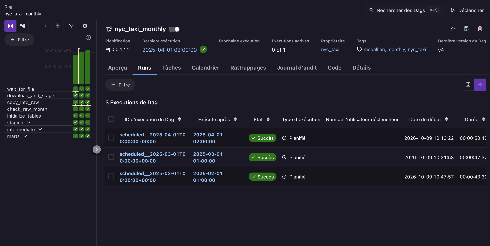
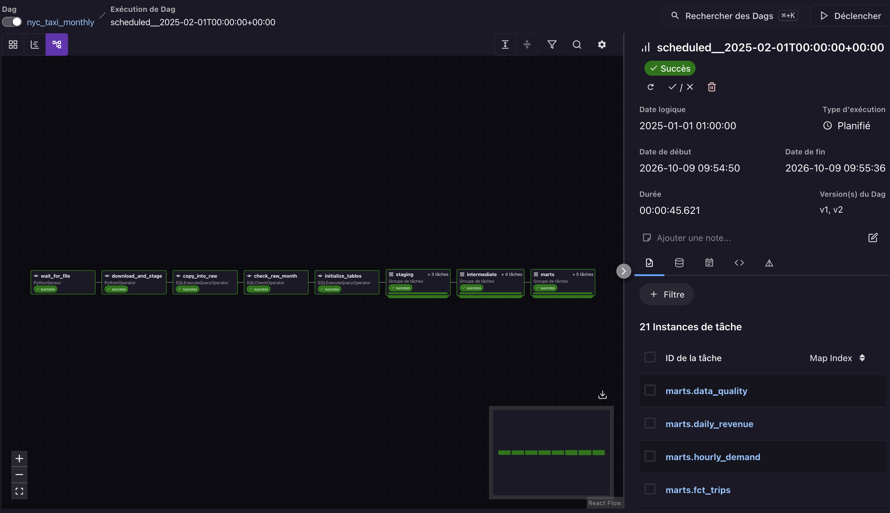
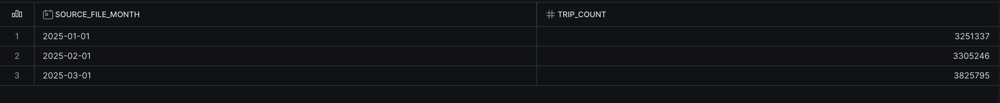
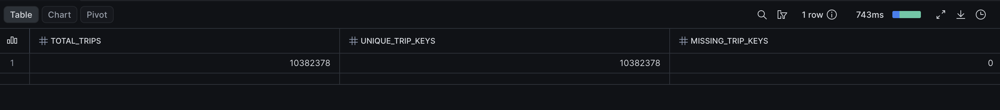
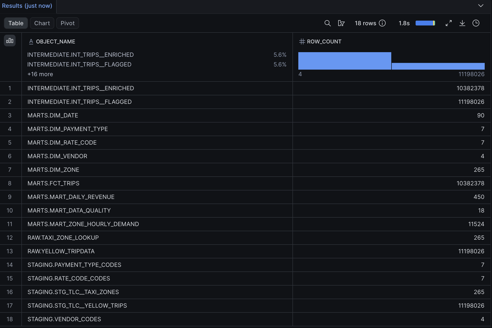
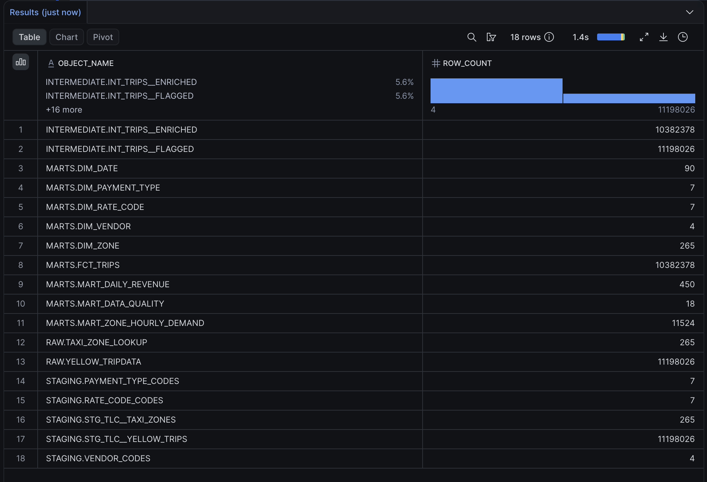
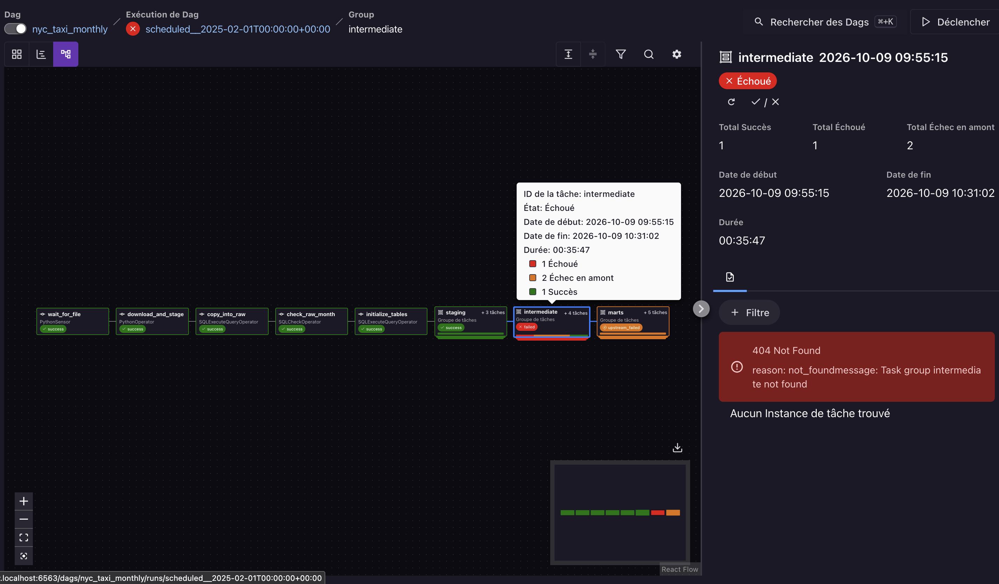
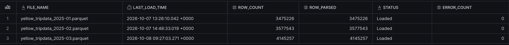

# Validation du pipeline Airflow — 9 octobre 2026

## Exécutions et volumes

La vue des exécutions confirme les trois succès et les groupes de transformations
réussis. Les identifiants de février, mars et avril désignent respectivement
les périodes de données de janvier, février et mars.




Les trois exécutions historiques ont été relancées avec Clear et signalées comme
réussies après intégration des transformations et contrôles. La capture du run de
janvier montre 21 instances de tâche, les groupes STAGING, INTERMEDIATE et MARTS
réussis, et les versions v1 et v2 dans l'historique. Le rejeu a pris en compte la
nouvelle version sans sélection manuelle de version dans la fenêtre Clear.



Le comptage Snowflake après les trois exécutions confirme :

| Mois source | Lignes FCT_TRIPS |
|---|---:|
| Janvier 2025 | 3 251 337 |
| Février 2025 | 3 305 246 |
| Mars 2025 | 3 825 795 |
| **Total** | **10 382 378** |



Le total de clés distinctes est également de 10 382 378 et aucune clé n'est NULL.
Le volume total correspond au résultat attendu du brief.



## Portée de la validation

Ces résultats attestent du fonctionnement du pipeline complet sur les trois mois
et des volumes et clés de la table de faits. Ils ne constituent pas, à eux seuls,
une comparaison avant/après de toutes les tables sur un rejeu de février, ni une
preuve de blocage en situation d'échec volontaire d'un contrôle.

## Protocole de vérification du rejeu

1. Sans autre exécution active, exécuter
   [verify_pipeline_counts.sql](../snowflake/verify_pipeline_counts.sql) dans Snowflake
   et conserver le tableau des 18 volumes.
2. Dans Airflow, ouvrir le run `scheduled__2025-03-01...`, dont la date logique est
   le 1er février 2025. Utiliser Clear sur l'ensemble de ses tâches, y compris celles
   réussies, et attendre la fin de cette seule exécution.
3. Relancer la même requête et comparer chaque volume à celui d'avant le rejeu.

Les requêtes utilisent COUNT(*) sur chaque table ou vue.
Ils incluent les vues STAGING. Les deux comparaisons de volumes et les preuves
visuelles permettent de distinguer une exécution réussie d'un rejeu vérifié.


## Résultat du rejeu de février

Les deux relevés avant et après rejeu présentent les mêmes volumes pour chacun
des 18 objets contrôlés. Aucun accroissement du nombre de lignes n'est observé.





| Objet | Avant | Après |
|---|---:|---:|
| INTERMEDIATE.INT_TRIPS__ENRICHED | 10 382 378 | 10 382 378 |
| INTERMEDIATE.INT_TRIPS__FLAGGED | 11 198 026 | 11 198 026 |
| MARTS.DIM_DATE | 90 | 90 |
| MARTS.DIM_PAYMENT_TYPE | 7 | 7 |
| MARTS.DIM_RATE_CODE | 7 | 7 |
| MARTS.DIM_VENDOR | 4 | 4 |
| MARTS.DIM_ZONE | 265 | 265 |
| MARTS.FCT_TRIPS | 10 382 378 | 10 382 378 |
| MARTS.MART_DAILY_REVENUE | 450 | 450 |
| MARTS.MART_DATA_QUALITY | 18 | 18 |
| MARTS.MART_ZONE_HOURLY_DEMAND | 11 524 | 11 524 |
| RAW.TAXI_ZONE_LOOKUP | 265 | 265 |
| RAW.YELLOW_TRIPDATA | 11 198 026 | 11 198 026 |
| STAGING.PAYMENT_TYPE_CODES | 7 | 7 |
| STAGING.RATE_CODE_CODES | 7 | 7 |
| STAGING.STG_TLC__TAXI_ZONES | 265 | 265 |
| STAGING.STG_TLC__YELLOW_TRIPS | 11 198 026 | 11 198 026 |
| STAGING.VENDOR_CODES | 4 | 4 |

Les volumes attendus du brief sont aussi confirmés pour FLAGGED, FCT_TRIPS,
MART_ZONE_HOURLY_DEMAND et MART_DATA_QUALITY. Cette comparaison valide la stabilité
des volumes sur ce rejeu ; elle n'est pas une comparaison de chaque valeur de
chaque ligne ni une preuve du blocage des contrôles en situation d'échec.

## Fichiers locaux et fichiers Airflow

Le script ingestion/load_month.py conserve les téléchargements dans data/input.
Le DAG utilise TemporaryDirectory dans le conteneur pour télécharger et transférer
le fichier sur le stage, puis supprime cette copie temporaire. Le chargement
COPY INTO lit ensuite le fichier sur le stage Snowflake. L'absence de mars dans
le dossier local data/input est donc compatible avec son chargement réussi.
Un rejeu Airflow télécharge de nouveau le fichier, même si COPY INTO peut ensuite
l'ignorer comme déjà chargé. La copie locale n'est pas requise pour le rendu.


## Échec volontaire du contrôle de rejet

Le 9 octobre 2026, max_rejection_rate_pct a été abaissé temporairement de 10 à 1.
L'exécution de janvier a été rejouée sans modification des règles de classification
ni des données sources pour ce test.

Le journal de intermediate.check_rejection_rate montre la condition rendue
`... <= 1` et le filtre `source_file_month = '2025-01-01'::date`.
Extraits du journal transmis, horodatages UTC :

```text
2026-10-09T08:31:02.380085Z Snowflake query id: 01c79c5f-0002-2b3f-0002-d70600020702
2026-10-09T08:31:02.520376Z Record: (True, False)
2026-10-09T08:31:02.521016Z AirflowException: Test failed.
```

La première valeur valide la présence du lot. La deuxième indique que son taux
de rejet, environ 6,44 %, dépasse le seuil de 1 %. L'échec provient donc du
contrôle métier, après exécution réussie de la requête Snowflake.



Le groupe INTERMEDIATE affiche une tâche réussie, une échouée et deux en échec
en amont. Le groupe MARTS est également en upstream_failed. Le pipeline empêche
ainsi la propagation vers les transformations suivantes. Les anciens résultats
MARTS restent présents ; le contrôle ne les efface pas.

Le journal porte attempt=2 après un rejeu manuel d'une tâche déjà exécutée ;
ce numéro ne prouve pas une relance automatique. Les contrôles conservent retries=0.
Les avertissements de démarrage ne sont pas la cause de l'exception SQLCheckOperator.

Le seuil a été rétabli à 10 et janvier a ensuite terminé en succès le
9 octobre à 08:48:40 UTC. La lecture des métadonnées Airflow confirme les trois
runs en succès ; l'[export des exécutions](resultats/airflow_runs_2026-10-09.csv)
conserve leurs dates logiques et heures de début et de fin.

## Historique de chargement Snowflake

La capture COPY_HISTORY confirme les trois fichiers Loaded, sans erreur, avec
3 475 226, 3 577 543 et 4 145 257 lignes lues et chargées. Les heures sont affichées
en UTC ; elles correspondent aux instants de l'export conservé, dont le décalage
horaire est indiqué explicitement.


