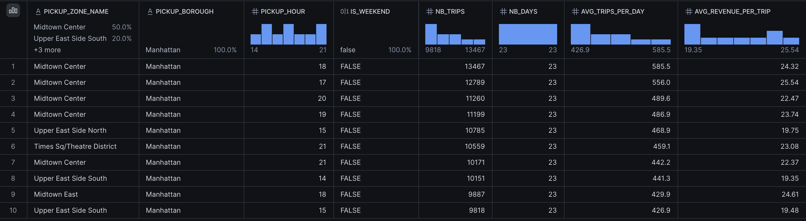

# Validation manuelle des transformations — janvier 2025

## Périmètre

Les SQL fournis ont été exécutés manuellement dans Snowflake sous TRANSFORMER,
avec les paramètres de janvier remplacés uniquement dans la copie exécutée.
Les fichiers SQL de transformation du dépôt conservent leurs paramètres Airflow.
Ces résultats valident les étapes décrites ci-dessous sur janvier ; ils ne
constituent pas une validation de leur orchestration ni des trois mois transformés.

Les contrôles sont regroupés dans
[verify_transformations_january.sql](../snowflake/verify_transformations_january.sql).

## Structures et volumes

Les deux vues STAGING conservent les volumes RAW : 11 198 026 trajets sur les
trois mois et 265 zones. Les tables de codes contiennent 4 fournisseurs,
7 modes de paiement et 7 types de tarif.

| Transformation de janvier | Lignes |
|---|---:|
| INT_TRIPS__FLAGGED | 3 475 226 |
| Trajets rejetés | 223 889 |
| Trajets valides avant dédoublonnage | 3 251 337 |
| Doublons supprimés parmi les valides | 0 |
| INT_TRIPS__ENRICHED | 3 251 337 |
| FCT_TRIPS | 3 251 337 |

ENRICHED et FCT_TRIPS contiennent chacune 3 251 337 clés distinctes et aucune
clé manquante. L'absence de doublons concerne les trajets valides et la clé
composite définie par le SQL fourni.

Les dimensions MARTS contiennent 265 zones, 4 fournisseurs, 7 modes de paiement,
7 types de tarif et 90 dates du 1er janvier au 31 mars 2025.

## Répartition des rejets

| Motif | Trajets |
|---|---:|
| amount_non_positive | 130 112 |
| distance_out_of_range | 90 327 |
| duration_non_positive | 2 051 |
| duration_too_long | 1 377 |
| pickup_outside_file_month | 22 |
| **Total** | **223 889** |

Le taux de rejet est d'environ 6,44 %. Le CASE attribue uniquement la première
raison rencontrée. Ces effectifs ne sont donc pas les comptages indépendants de
chaque anomalie réalisés lors de l'exploration RAW. Le contrôle des montants teste
fare_amount < 0 OU total_amount <= 0 ; il est plus large que total_amount < 0.
Les trajets rejetés restent conservés dans RAW et dans FLAGGED.

## Demande par zone et heure

La [requête de classement](../snowflake/analyze_hourly_demand.sql) lit
MART_ZONE_HOURLY_DEMAND. La table est recalculée sur tous les trajets présents dans
FCT_TRIPS : la capture ci-dessous porte uniquement sur janvier 2025.

Tous les groupes ci-dessous sont situés à Manhattan, hors week-end, et comportent
23 dates observées. Chaque heure désigne le créneau de cette heure à la suivante.

| Zone | Heure | Trajets | Moyenne par jour observé | Montant moyen par trajet (USD) |
|---|---:|---:|---:|---:|
| Midtown Center | 18 | 13 467 | 585,5 | 24,32 |
| Midtown Center | 17 | 12 789 | 556,0 | 25,54 |
| Midtown Center | 20 | 11 260 | 489,6 | 22,47 |
| Midtown Center | 19 | 11 199 | 486,9 | 23,74 |
| Upper East Side North | 15 | 10 785 | 468,9 | 19,75 |
| Times Sq/Theatre District | 21 | 10 559 | 459,1 | 23,08 |
| Midtown Center | 21 | 10 171 | 442,2 | 22,37 |
| Upper East Side South | 14 | 10 151 | 441,3 | 19,35 |
| Midtown East | 18 | 9 887 | 429,9 | 24,61 |
| Upper East Side South | 15 | 9 818 | 426,9 | 19,48 |

Midtown Center à 18 h arrive en tête du classement par volume total ; cette zone
occupe cinq places sur dix. Les dix groupes sont hors week-end, mais le classement
par volume cumulé ne corrige pas la différence de nombre de jours entre semaine
et week-end. La moyenne journalière utilise uniquement les dates avec au moins
un trajet dans le groupe.

Le montant moyen est calculé à partir de total_amount : il ne mesure pas un
bénéfice net. Les trajets observés ne mesurent pas les demandes non satisfaites.
Ces résultats concernent les taxis jaunes de la source TLC, pas uniquement la
flotte Hudson Cab Partners. Ils ne constituent pas encore la réponse finale sur
janvier à mars, notamment sa ventilation par mode de paiement.
